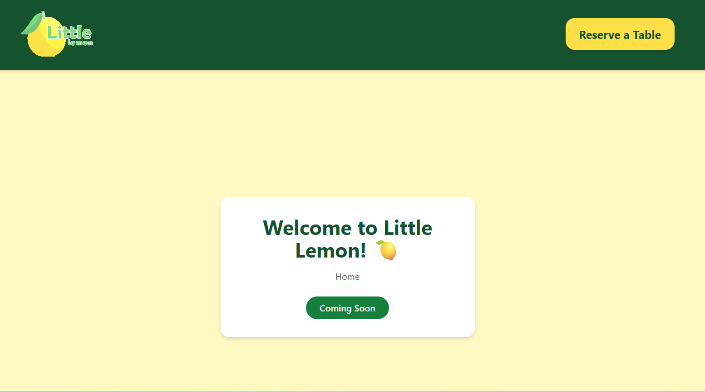
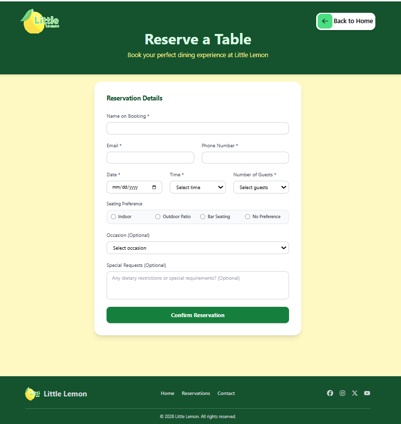
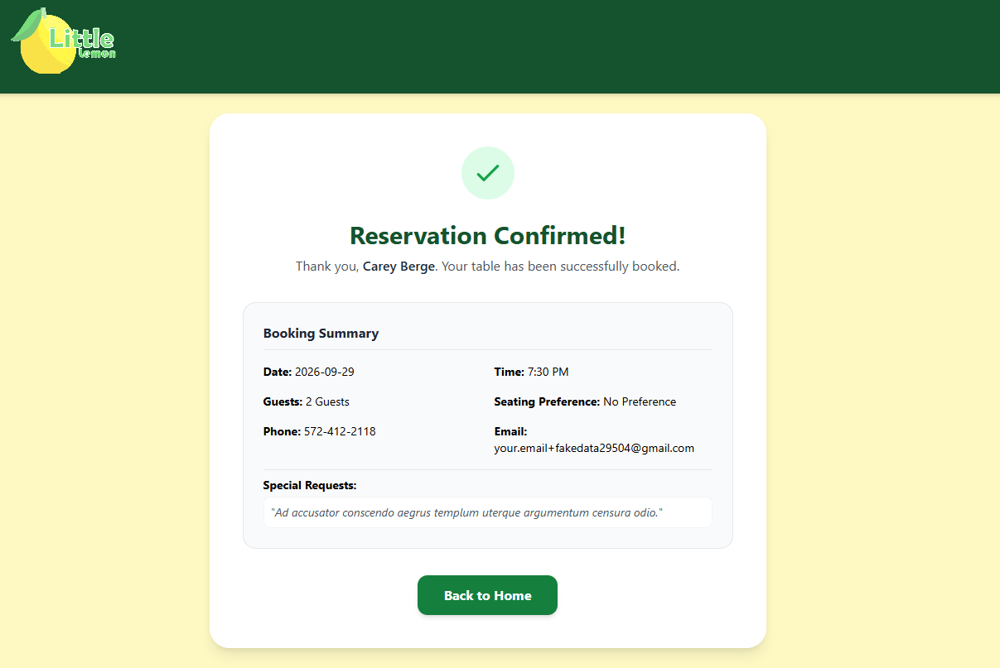

# 🍽️ Reserve Table

A modern and responsive restaurant table reservation application built with React, TypeScript, and Vite. The application provides a seamless booking experience, allowing customers to reserve tables quickly and efficiently.

---

## 🔗 Live Demo

Add your deployed application link here:

https://your-demo-link.com

---

## 📸 Preview

### Home Page



### Reservation Form



### Booking Confirmation



---

## 📋 Table of Contents

* Overview
* Features
* User Journey
* Tech Stack
* Project Structure
* Installation
* Usage
* Validation Rules
* Future Enhancements
* Performance
* Accessibility
* Author

---

## 📖 Overview

Reserve Table is a restaurant reservation system designed to provide users with a fast, intuitive, and accessible booking experience.

The application enables customers to:

* Select a reservation date.
* Choose an available time slot.
* Specify the number of guests.
* Submit booking details.
* Receive booking confirmation.

The project follows modern frontend development practices with a focus on usability, maintainability, and performance.

---

## ✨ Features

### User Features

* Easy table reservation process.
* Responsive user interface.
* Real-time form validation.
* Booking confirmation page.
* Clean and modern design.
* Mobile-friendly experience.

### Developer Features

* Component-based architecture.
* Type-safe code with TypeScript.
* Reusable UI components.
* ESLint integration.
* Scalable folder structure.
* Optimized production builds.

---

## 👤 User Journey

1. User visits the homepage.
2. User clicks "Reserve a Table".
3. User fills out the reservation form.
4. Form validation checks input data.
5. User submits the reservation.
6. Confirmation page displays booking details.

---

## 🛠️ Tech Stack

### Frontend

* React
* TypeScript
* Vite

### Form Management

* Formik
* Yup

### Styling

* CSS3
* Flexbox
* CSS Grid

### Code Quality

* ESLint

---

## 📂 Project Structure

```text
src/
├── assets/
│   ├── images/
│   └── icons/
│
├── components/
│   ├── Header/
│   ├── Footer/
│   ├── Hero/
│   ├── ReservationForm/
│   └── BookingCard/
│
├── pages/
│   ├── Home/
│   ├── Booking/
│   └── ConfirmedBooking/
│
├── hooks/
├── utils/
├── types/
│
├── App.tsx
├── main.tsx
└── index.css
```

---

## 🚀 Installation

Clone the repository:

``` bash git clone https://github.com/your-username/reserve-table.git


Move into the project directory:

```bash
cd reserve-table
```

Install dependencies:

```bash
npm install
```

Run the development server:

```bash
npm run dev
```

---

## 💻 Usage

Start the application:

```bash
npm run dev
```

Build for production:

```bash
npm run build
```

Preview production build:

```bash
npm run preview
```

Run linting:

```bash
npm run lint
```

---

## ✅ Validation Rules

The reservation form validates:

* Full Name
* Reservation Date
* Reservation Time
* Number of Guests
* Email Address
* Phone Number (optional)

Error messages are displayed instantly to improve user experience.

---

## 📱 Responsive Design

The application is optimized for:

| Device  | Supported |
| ------- | --------- |
| Desktop | ✅         |
| Laptop  | ✅         |
| Tablet  | ✅         |
| Mobile  | ✅         |

---

## ⚡ Performance

Key performance goals:

* Fast page load times.
* Optimized asset delivery.
* Efficient component rendering.
* Lightweight bundle size using Vite.

---

## ♿ Accessibility

Accessibility considerations include:

* Semantic HTML.
* Keyboard navigation support.
* Accessible form labels.
* Clear validation feedback.
* Sufficient color contrast.

---

## 🚀 Future Enhancements

* User authentication.
* Reservation history.
* Admin dashboard.
* Email notifications.
* SMS confirmation.
* Real-time table availability.
* Online payments.
* Multi-language support.

---

## 📄 License

This project is licensed under the MIT License.

---

## 👨‍💻 Author

Osama Massoud

Frontend Developer

GitHub: https://github.com/your-username

LinkedIn: https://www.linkedin.com/in/osama-massoud-100445b0

Email: o.tawakul@gmail.com

---

⭐ If you like this project, consider giving it a star on GitHub.
